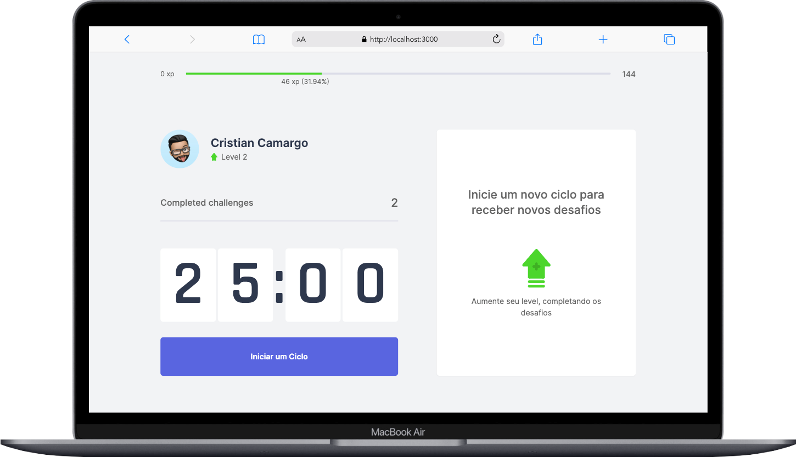

<h1 align="center">NLW04 - MoveIt APP NuxtJS</h1>
  <p align="center">
    
  </p>

  <br><br><br>

<h2 align="center">Objetivo</h2>
<p align="center">- Esta aplicação foi desenvolvida seguinto a lista do canal <a href="https://www.youtube.com/watch?v=VbkFOWw4yeY&list=PL6GSB1I1APjqS1ligyQwHeVT0sAOWNkWH">FrontVerso</a></p>
<p align="center">- O objetivo era desenvolver a aplicação MoveIt que foi desenvolvida durante a NL04 da <a href="https://www.rocketseat.com.br/">Rocketseat</a> utilizando o Nuxt Js como framework</p>
<p align="center">- Utilizamos o <a href="https://nuxtjs.org/">Nuxt Js</a>, framework construido sobre o <a href="https://vuejs.org/">Vue Js</a> para construir nosso FrontEnd, e o <a href="https://tailwindcss.com/">Tailwind CSS</a> para trabalhar com nosso estilos</p>
<p align="center">- A aplicaçao segue um modelo de pomodoro, que ao finalizar o contador da ao usuário uma quantidade de xp, que ele usa para subir de nível</p>


<br><br><br><br><br><br>

## Setup para Rodar a Aplicação

```bash
# Instalar as dependencias
$ npm install

# Levantar servidor Nuxt, para rodar aplicação
$ npm run dev

# Build para produção
$ npm run build
$ npm run start

# Geral projeto estático para servidores converncionais
$ npm run generate
```

